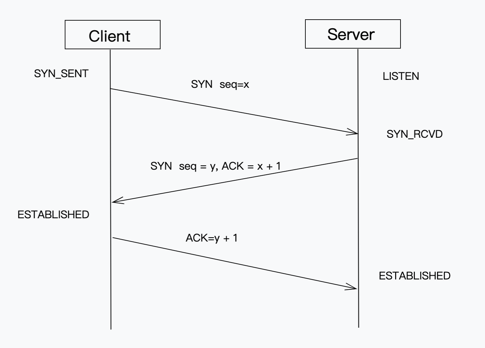
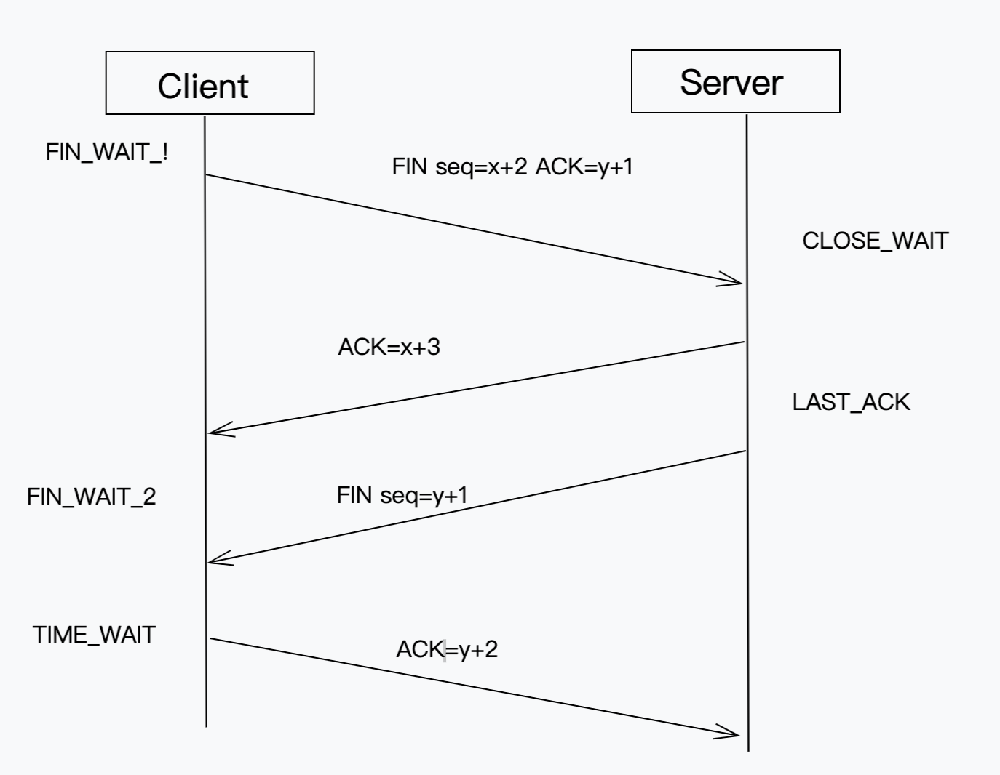

# 学习笔记-客户端和服务器端的交互处理

> 面试题：当用户在地址栏中输入网址，到最后看到页面，中间都经历了什么？

=> 输入网址 

=> 解析 URL 地址

=> DNS域名解析服务器（通过域名找到对应服务器的外网IP）

=> 相对应服务器发送HTTP请求（TCP协议的三次握手）

=> 发送 HTTP 请求

=>  服务器处理请求，并返回给客户端

=>  断开TCP 链接通道

=> 客户端渲染

**URL知识**

- URI / URL / URN
  - URI（Uniform Resource Identifier / 统一资源标志符）
    - URL
    - URN
  - URL（Uniform Resource Locator / 统一资源定位符）
    - http://www.zhufengpeixun.cn
  - URN（Uniform Resource Name / 统一资源名称）
    - urn:isbn:0451450523
- 一个完整URL的组成部分和实际意义
  - 协议：http 、 https 、 ftp
  - 域名：一级域名、二级域名、常用域名的性质
  - 端口号：80 、443 、 21 、 端口号范围
  - 请求资源路径名称：伪URL
  - 问号参数
  - HASH值
- 特殊字符加密和解密
  - encodeURI / decodeURI
  - encodeURIComponent / decodeURIComponent
  - escape / unescape
  - ……


## 1.解析输入的URL地址

> http://www.zhufengpeixun.cn:80/index.html?lx=teacher#video

- 传输协议（把信息在客户端和服务器端进行传递，类似于快递小哥）
  + http 超文本传输协议（传输的内容除了文本，还有可能是其它类型：二进制编码、BASE64码、文件流等等）
  + https 比HTTP更加安全的传输协议（传输通道设置加密算法SSL），一般支付类网站都是HTTPS协议
  + ftp 资源上传协议，一般应用于把本地文件直接上传到服务器端

- 域名  zhufengpeixun.cn
  + 一级域名 www.zhufengpeixun.cn
  + 二级域名 video.zhufengpeixun.cn
  + 三级域名 webG.video.zhufengpeixun.cn
  + 常用域名性质：.com国际 / .cn中国 / .gov政府 / .org官方 / .net系统 / .io博客 / .vip ...

- 端口号 （根据端口号，找到当前服务器上指定的服务）
  + 0~65535之间
  + 不同协议有自己默认的端口号（也就是自己不用写，浏览器会帮我们加上）
    + http => 80
    + https => 443
    + ftp => 21
    + 除这几个在书写的时候可以省略，其余的不能省

- 请求资源的路径和名称
  + /stu/index.html
    + 一般情况下，如果我们访问的是index.html等，可以省略不写（因为服务端一般会设置index.html为默认文档，当然可以自定义）
  + 伪URL
    + SEO优化    https://item.jd.com/100006038463.html （以下为示例，并不是真实情况）
      + 静态地址：https://item.jd.com/100006038463.html （方便搜索引擎抓取）
      + 动态页面地址，真实地址：https://item.jd.detail.php?id=100006038463 需要把这样的地址重写为上述的静态地址（URL伪重写技术）
    + 数据请求的接口地址  /user/list

- 问号传参部分 ?xxx=xxx
  + 客户端基于GET系列请求，把信息传递会服务器，一般都会基于问号传参的模式
  + 页面之间跳转，信息的一些通信也可以基于问号传参的方式（单页面中组件和组件跳转之间的信息通信，也可能基于问号传参）
  + 关于传递的内容需要进行编码处理（处理特殊字符和中文）
    + encodeURI / decodeURI（只能把空格和中文内容进行编码和解码，所以一般应用这种模式处理整个URL的编码  `encodeURI(http://rain7.top?id=12&lx=10&picture=http://rain7.top/public/头像.png)`）
    + encodeURIComponent / decodeURIComponent（会把所有的特殊字符和汉字都进行编码，一般不会整个URL编码，只会给传递的每一个参数单独编码 `http://rain7.top?id=12&lx=10&picture=encodeURIComponent(http://rain7.top/public/头像.png)`）
    + escape / unescape（这种方式不是所有的后台都有，所以一般只应用于客户端自己内部编码，例如：存储Cookie信息，把存储的中文进行编码和解码；特殊符号也会被编码）
    + ...

- 设置哈希HASH  #xxx

## 2.DNS域名解析

>  DNS域名解析是什么？
>
> - 发布站点时配置域名解析
> - 网址访问进行DNS域名反解析
>
> DNS Prefetch 即 DNS 预获取 ：减少DNS的请求次数，进行DNS预获取，缓存时间在1分钟左右

网站中，每发送一个TCP请求，都要进行DNS解析（一但当前域名解析过一次，浏览器一般会缓存解析记录，缓存时间一般在1分钟左右，后期发送的请求如果还是这个域名，则跳过解析步骤 =>这是一个性能优化点）

真实项目中，一个大型网站，他要请求的资源是分散到不同的服务器上的（每一个服务器都有自己的一个域名解析）

- WEB服务器（处理静态资源文件，例如：html/css/js等 的请求）
- 数据服务器（处理数据请求）
- 图片服务器 （处理图片请求）
- 音视频服务器
- ......
  这样导致，我们需要解析的DNS会有很多次

**优化技巧：DNS Prefetch 即 DNS 预获取**

> 让页面加载（尤其是后期资源的加载）更顺畅更快一些

```html
<meta http-equiv="x-dns-prefetch-control" content="on">
<link rel="dns-prefetch" href="//static.360buyimg.com">
<link rel="dns-prefetch" href="//misc.360buyimg.com">
<link rel="dns-prefetch" href="//img10.360buyimg.com">
<link rel="dns-prefetch" href="//img11.360buyimg.com">
<link rel="dns-prefetch" href="//img12.360buyimg.com">
.......
```

### 

## 3.建立TCP连接（三次握手）构建客户端和服务器端的连接通道

只有建立好连接通道，才能基于HTTP等传输协议，实现客户端和服务器端的信息交互



- 第一次握手：由浏览器发起，告诉服务器我要发送请求了
- 第二次握手：由服务器发起，告诉浏览器我准备接受了，你赶紧发送吧
- 第三次握手：由浏览器发送，告诉服务器，我马上就发了，准备接受吧

## 4.发送HTTP请求

基于HTTP等传输协议，客户端把一些信息传递给服务器

- HTTP请求报文（所有客户端传递给服务器的内容，统称为请求报文）
  + 谷歌控制台 NetWork 中可以看到
  + 请求起始行
  + 请求首部（请求头）
  + 请求主体

- 强缓存 和 协商缓存（性能优化：减少HTTP请求的次数）
  + 强缓存 ( Cache-Control 和 Expires )
  + 协商缓存 ( Last-Modified 和 Etag )

## 5.服务器接受到请求，并进行处理，最后把信息返回给客户端

- WEB（图片）服务器和数据服务器
  - Tomcat
  - Nginx
  - Apache
  - IIS
  - ……
- HTTP响应报文（所有服务器返回给客户端的内容）
  - 响应起始行
  - 响应状态码
    - 200 / 201 / 204
    - 301 / 302 / 304 / 307
    - 400 / 401 / 404
    - 500 / 503
  - 响应头（首部）
    - date存储的是服务器的时间
    - ...
  - 响应主体
  - 服务器返回的时候是：先把响应头信息返回，然后继续返回响应主体中的内容（需要的信息大部分都是基于响应主体返回的）

## 6.断开TCP链接通道（四次挥手）



- 第一次挥手：由浏览器发起，发送给服务器，我请求报文发送完了，你准备关闭吧；
- 第二次挥手：由服务器发起，告诉浏览器，我接收完请求报文，我准备关闭，你也准备吧；
- 第三次挥手：由服务器发起，告诉浏览器，我响应报文发送完毕，你准备关闭吧；
- 第四次挥手：由浏览器发起，告诉服务器，我响应报文接收完毕，我准备关闭，你也准备吧；

**Connection: Keep-Alive 保持TCP不中断（性能优化点，减少每一次请求还需要重新建立链接通道的时间）**

## 7.客户端渲染页面


来源：珠峰WEB前端高级课程

