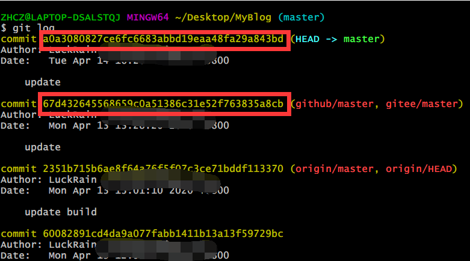
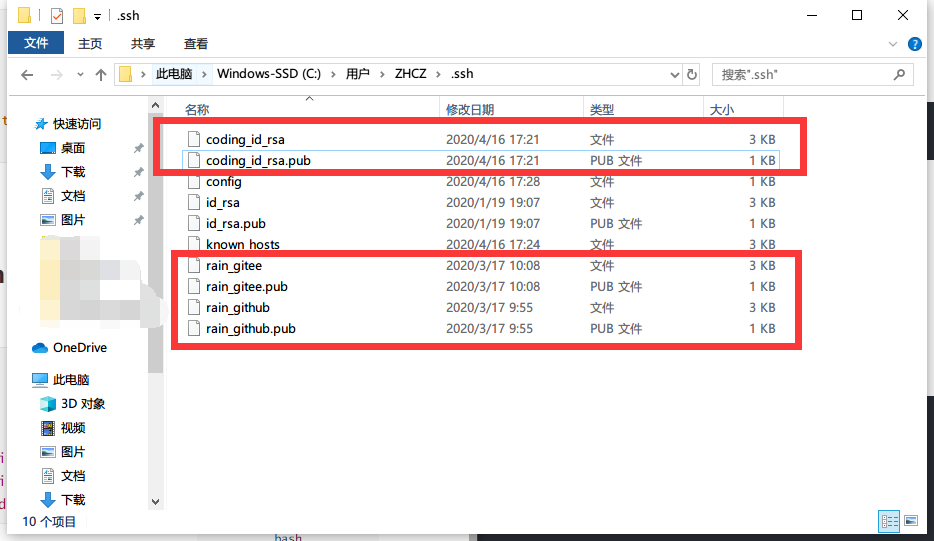
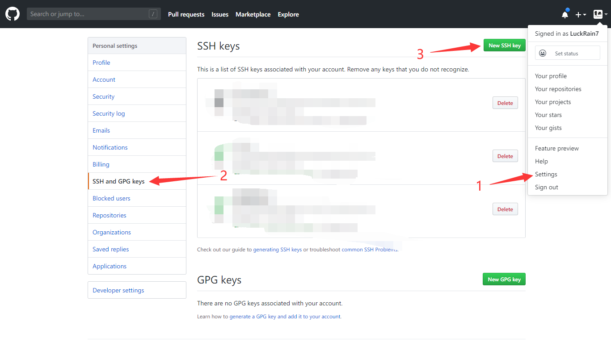
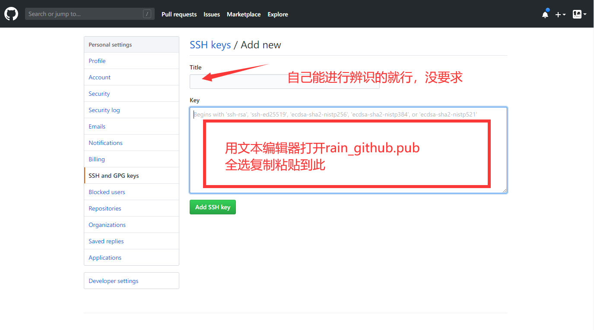
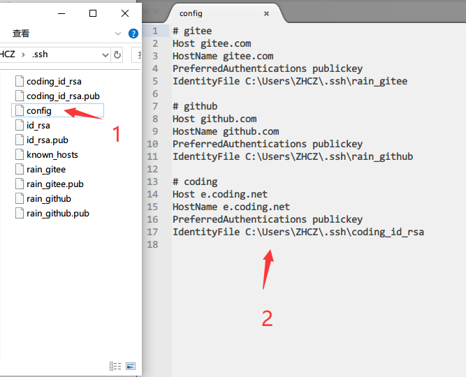

# Git 常用命令及应用这一篇就够了（新手向）

## 1.  git 常用命令

### 1.1   常用命令

```bash
# 初始化git
git init 

# 克隆项目
git clone [url] 

# 显示文件状态
git status -s 

# 添加文件到暂存区
git add . #添加所有文件到暂存区
git add [文件名] #添加指定文件到暂存区

# 提交暂存区到仓库区
git commit -m [提交信息] 

# 拉取远程仓库的变化，更新本地分支
git pull 

# 推送到远程仓库
git push 
git push [远程主机名] [本地分支名]

# 更新所有的远程仓库信息
git fetch --all 

# 合并指定分支到当前分支
git merge [分支名] 

# 分支相关
git branch # 列出所有本地分支
git checkout [分支名] # 切换到指定分支
git checkout -b [本地分支名] origin/[远程分支名] # 拉取远程分支

#查看项目中git配置
git config --list

# 配置全局信息
git config --global user.name "[name]"
git config --global user.email "[email address]"

# 项目中配置
git config user.name "[name]"
git config user.email "[email address]"
```

### 1.2  git remote 

> 管理远程仓库 

```bash
#查看远程仓库
git remote 

#查看关联的远程仓库的详细信息
git remote -v 

#添加远程仓库的关联
git remote add origin [远程仓库地址] 

#删除远程仓库的关联
git remote remove [远程仓库名称] 

#更新远程仓库的分支
git remote update origin --prune 
```

### 1.3  git rebase

> rebase操作可以把本地未push的分叉提交历史整理成直线；
>
> rebase的目的是使得我们在查看历史提交的变化时更容易，因为分叉的提交需要三方对比。
>
> 个人感觉非特定情况，还是不建议使用


## 2.  Git的常见应用

### 2.1  本地项目上传至多个远程库

```bash
# 添加关联远程库(这里以github和码云为例，大家替换掉仓库地址即可)
git remote add gitee [url]
git remote add gitee git@gitee.com:LuckRain/Knowledge-Sharing.git
git remote add github git@github.com:LuckRain7/Knowledge-Sharing.git

# 推送时分别将master分支推送到关联远程库
git push gitee master
git push github master

# 删除关联远程库
git remote rm [origin] 
```

### 2.2  Git 远程分支强制覆盖本地分支

> 需在需要覆盖的分支上进行一下操作

```bash
# 更新所有的远程仓库信息
git fetch --all  

# 强制重置为 origin/master（可以换成你需要的远程分支） 远程分支
git reset --hard [origin/master] 

# 拉取最新代码
git pull
```

### 2.3  Git 配置忽略规则(.gitignore）不生效解决方案

>  清除缓存 重新提交

```bash
# 清除缓存
git rm -r --cached .

# 将所有文件添加到缓存区
git add . 

# 添加提交信息
git commit -m 'update .gitignore' 

# 强制覆盖 以远程分支 rain 为例
git push
```

### 2.4  Git 强制提交本地分支覆盖远程分支

```bash
# 将所有文件添加到缓存区
git add .

# 添加提交信息
git commit -m '更新信息'

# 强制覆盖 以远程分支 rain 为例
git push origin rain --force
```

### 2.5 分支合并

#### 2.5.1  情景：

我现在的分支是 rain

我要把别人的分支 snow 合并到我的分支上来

#### 2.5.2  操作：

1.  首先要进行切换分支（切换分支前要保证自己分支的内容都已经提交了）

```bash
# 情况一:分支是本地分支(直接切换)
git branch snow  

# 情况二:分支是远程分支(新建本地分支并与远程分支关联)
git checkout -b snow origin/snow
```

2.  在 snow 分支上拉取最新代码

```bash
git pull
```

3.  切换回我自己的分支rain

```bash
git branch rain  
```

4. 执行合并

```bash
git merge rain 
```

5.  处理代码冲突

我这里比较喜欢使用 VS Code 的可视化界面解决代码冲突

### 2.6  版本回溯

```bash
#版本回退到上一个版本
git reset --hard HEAD^ 

# 回溯到指定版本
git log #查看git历史版本信息，并找到指定版本的commit id
git reset --hard [commitId]  # 进行回溯
```

下图是 commitId 形式



### 2.7  同时配置gitee&github(多平台)ssh

#### 2.7.1.  本地创建多个ssh

```bash
# 进入.ssh目录
cd ~/.ssh

# 生成ssh
ssh-keygen -t rsa -C "xxxx@email.com" -f "rain_github" # 后续绑定github平台
ssg-keygen -t rsa -C "xxxx@email.com" -f "rain_gitee"  # 后续绑定gitee平台
ssg-keygen -t rsa -C "xxxx@email.com" -f "coding_id_rsa"  # 后续绑定coding平台
```

会在本地生成如下文件



#### 2.7.2.  在各个平台进行ssh绑定

##### 2.7.2.1  github平台操作





##### 2.7.2.2  gitee 平台操作


#### 2.7.3.  解决ssh冲突配置

在 `C:\Users\ZHCZ\.ssh` 文件夹中新建 `config` 文件

进行如下配置

```bash
# gitee
Host gitee.com
HostName gitee.com
PreferredAuthentications publickey
IdentityFile C:\Users\ZHCZ\.ssh\rain_gitee

# github
Host github.com
HostName github.com
PreferredAuthentications publickey
IdentityFile C:\Users\ZHCZ\.ssh\rain_github

# coding
Host e.coding.net
HostName e.coding.net
PreferredAuthentications publickey
IdentityFile C:\Users\ZHCZ\.ssh\coding_id_rsa
```




#### 2.7.4. 测试

```bash
ssh -T git@gitee.com
ssh -T git@github.com 
```

返回success则表示设置成功


###  推荐阅读

  - [在 Array.reduce 中正确使用 async](https://mp.weixin.qq.com/s/9wl8-SYspr3s358Tf0CmSg)

- [如何在 Array.filter 中正确使用 Async](https://mp.weixin.qq.com/s/OtFsaLb2a26D0Uz4aFaoAw)

- [如何在 Array.forEach 中正确使用 Async](https://mp.weixin.qq.com/s/39J2KO8h_cBKg3MWB63L7w)

- [如何在 Vue中优雅的使用防抖节流](https://mp.weixin.qq.com/s/mFmqyicyfaAOdxmhlPmSRQ)


