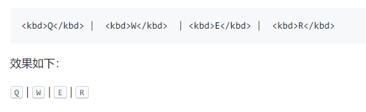

# 玩转 GitHub 的几个小技巧

## 1.  GitHub 搜索技巧

在项目名称搜索 in:name xxx


在项目描述搜索 in:description xxx


在项目 README 搜索 in:readme xxx


利用 star 搜索 stars:>3000 xxx 


利用 fork 搜索 forks:>300 xxx


也可以直接使用 GitHub 高级搜索页面 [ https://github.com/search/advanced ]( https://github.com/search/advanced )


## 2.  轻松浏览文件和目录

Octotree 浏览器插件，可以帮助您浏览目录，并使用熟悉的树状结构打开文件。

地址：[谷歌商店网址(需要稳定的网络环境)]( https://chrome.google.com/webstore/detail/octotree/bkhaagjahfmjljalopjnoealnfndnagc ) | [GitHub]( https://github.com/ovity/octotree )

下方图片来源  `https://github.com/ovity/octotree (Octotree 官方文档)`


## 3.  Markdown技巧

### 3.1 键盘标签

> 可以使用  `<kbd> ` 标签进行包裹，会使文本看起来像按钮
> 

```
<kbd>Q</kbd> |  <kbd>W</kbd>  | <kbd>E</kbd> |  <kbd>R</kbd> 
```

效果如下：

<kbd>Q</kbd> |  <kbd>W</kbd>  | <kbd>E</kbd> |  <kbd>R</kbd> 



### 3.2  十六进制代码可视化

十六进制代码可视化：`#C6E48B` `#7AC96F` `#249A3C` `#196127`

```
十六进制代码可视化: `#C6E48B` `#7AC96F` `#249A3C` `#196127`
```

### 3.3 差异可视化

 可以使用反引号可视化差异，并`diff`根据需要突出显示红色或绿色的线。 

```
​```diff
- box.onclick = fn.bind(obj, 200);
+ box.onclick = fn.call(obj, 200);
​```
```

效果如下

```diff
- box.onclick = fn.bind(obj, 200);
+ box.onclick = fn.call(obj, 200);
```

###  3.4 折叠效果

添加冗长的错误日志或冗长程序输出的问题可以解决的错误有帮助的，但如果它占用页的垂直空间，可以考虑使用`  <details>  `和` <summary> `标签。 

```
Having some problems firing up the laser.

<details>
<summary>Click here to see terminal history + debug info</summary>
<pre>
488 cd /opt/LLL/controller/laser/
489 vi LLLSDLaserControl.c
490 make
491 make install
492 https://luckrain7.github.io/Knowledge-Sharing/resource/2020/0427/sanity_check
493 https://luckrain7.github.io/Knowledge-Sharing/resource/2020/0427/configure -o test.cfg
494 vi test.cfg
495 vi ~/last_will_and_testament.txt
496 cat /proc/meminfo
497 ps -a -x -u
498 kill -9 2207
499 kill 2208
500 ps -a -x -u
501 touch /opt/LLL/run/ok
502 LLLSDLaserControl -ok1
</pre>
</pre<details>
```

效果如下：

<details>
<summary>Click here to see terminal history + debug info</summary>
<pre>
488 cd /opt/LLL/controller/laser/
489 vi LLLSDLaserControl.c
490 make
491 make install
492 https://luckrain7.github.io/Knowledge-Sharing/resource/2020/0427/sanity_check
493 https://luckrain7.github.io/Knowledge-Sharing/resource/2020/0427/configure -o test.cfg
494 vi test.cfg
495 vi ~/last_will_and_testament.txt
496 cat /proc/meminfo
497 ps -a -x -u
498 kill -9 2207
499 kill 2208
500 ps -a -x -u
501 touch /opt/LLL/run/ok
502 LLLSDLaserControl -ok1
</pre>
</pre<details>


### 3.5  使文字和图像居中

在 MarkDown 中直接是使用居中DIV

```
<div align="center">

<p>This is RainCode</p>
</div>
```

效果如下：

<div align="center">

<p>This is RainCode</p>
</div>

### 3.6 较小的文字

 在`<sup>`或`<sub>`标记中换行以使其变小。非常适合在图像下添加“图1：描述”之类的内容，或者使表中的文本变小以使其不会水平滚动。 

```
<div align="center">
<br>
<sup><strong>Fig 1:</strong> luckrain7's logo</sup>
</div>
```

效果如下：

<div align="center">
<br>
<sup><strong>Fig 1:</strong> luckrain7's logo</sup>
</div>


