# 5月23日 GitHub JavaScript 趋势榜项目
## 1.  RocketChat/Rocket.Chat

项目地址：[https://github.com/RocketChat/Rocket.Chat](https://github.com/RocketChat/Rocket.Chat)

stars:26769 | forks:5856 | 57 stars today 

 团队通信的最终免费开源解决方案。 

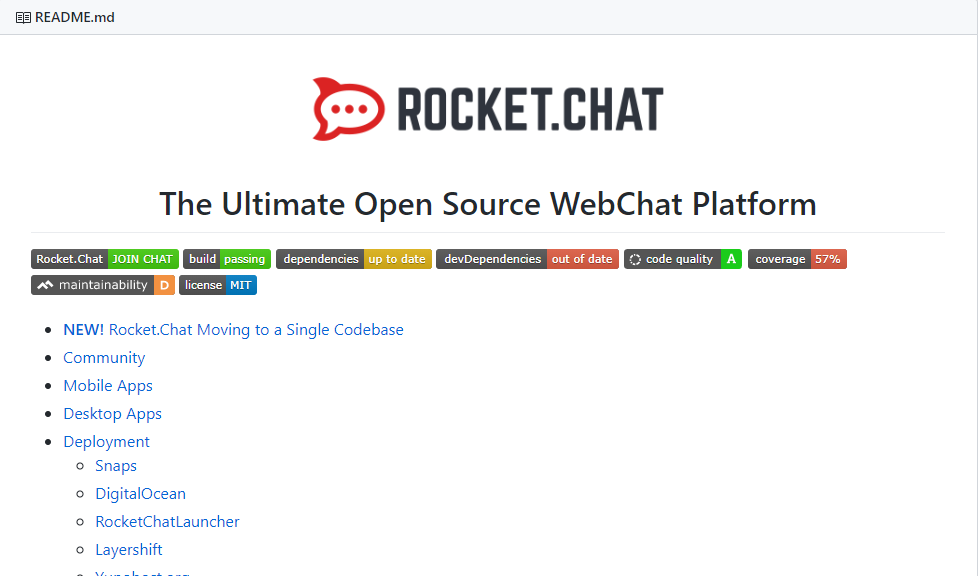

## 2.  manojVivek/responsively-app

项目地址：[https://github.com/manojVivek/responsively-app](https://github.com/manojVivek/responsively-app)

stars:1251 | forks:54 | 392 stars today 

 一个修改后的浏览器，有助于响应性web开发。 

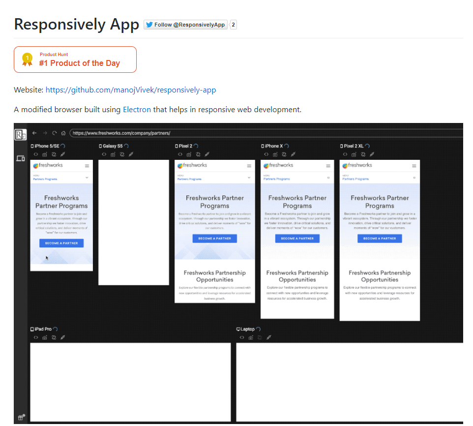

## 3.  openspug/spug

项目地址：[https://github.com/openspug/spug](https://github.com/openspug/spug)

stars:2776 | forks:595 | 266 stars today 

开源运维平台：面向中小型企业设计的轻量级无Agent的自动化运维平台，整合了主机管理、主机批量执行、主机在线终端、应用发布部署、在线任务计划、配置中心、监控、报警等一系列功能。

## 4.  appwrite/appwrite

项目地址：[https://github.com/appwrite/appwrite](https://github.com/appwrite/appwrite)

stars:2710 | forks:351 | 45 stars today 

 为web、本机和移动开发人员提供端到端后端服务器

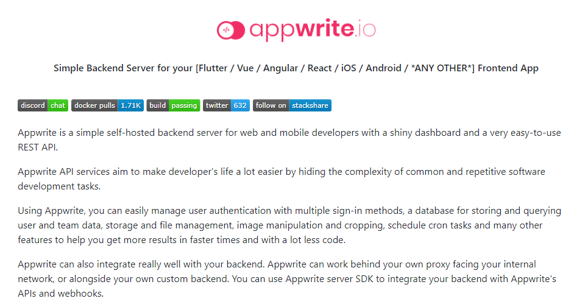

## 5.  mozilla/pdf.js

项目地址：[https://github.com/mozilla/pdf.js](https://github.com/mozilla/pdf.js)

stars:30736 | forks:7226 | 27 stars today 

 JavaScript PDF阅读器 

## 6.  jasminmif/react-interactive-paycard

项目地址：[https://github.com/jasminmif/react-interactive-paycard](https://github.com/jasminmif/react-interactive-paycard)

stars:1736 | forks:190 | 94 stars today 

基于 React 的交互 Paycard 

## 7.  puppeteer/puppeteer

项目地址：[https://github.com/puppeteer/puppeteer](https://github.com/puppeteer/puppeteer)

stars:61552 | forks:6361 | 65 stars today 

 无头Chrome Node.js API 

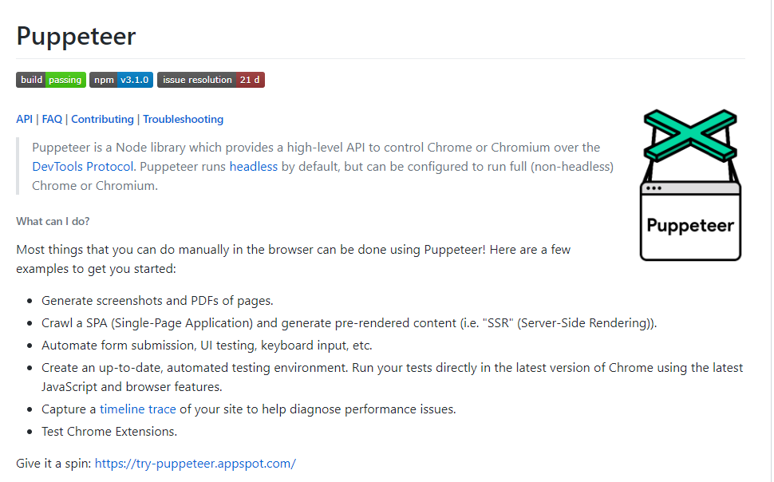

## 8.  frikky/Shuffle

项目地址：[https://github.com/frikky/Shuffle](https://github.com/frikky/Shuffle)

stars:118 | forks:13 | 45 stars today 

安全堆栈的自动化平台 

## 9.  laurent22/joplin

项目地址：[https://github.com/laurent22/joplin](https://github.com/laurent22/joplin)

stars:15913 | forks:1623 | 41 stars today 

 Joplin -一个开源的笔记和待办事项应用程序与同步功能的Windows, macOS, Linux, Android和iOS。

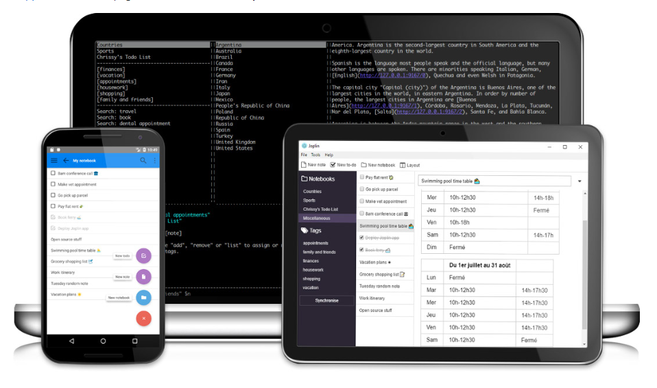 

## 10.  vuejs/vuex

项目地址：[https://github.com/vuejs/vuex](https://github.com/vuejs/vuex)

stars:23815 | forks:7896 | 19 stars today 

 Vue.js的集中状态管理。 

## 11.  carbon-design-system/carbon

项目地址：[https://github.com/carbon-design-system/carbon](https://github.com/carbon-design-system/carbon)

stars:3024 | forks:676 | 7 stars today 

 一个由IBM建立的设计系统 

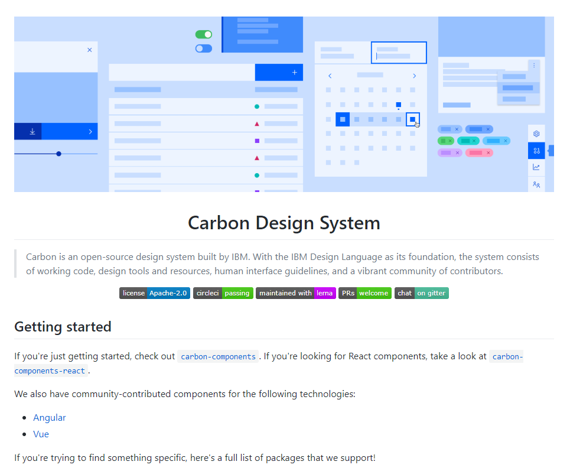

## 12.  nosir/cleave.js

项目地址：[https://github.com/nosir/cleave.js](https://github.com/nosir/cleave.js)

stars:15633 | forks:1356 | 29 stars today 

cleave.js有一个简单的目的:帮助你自动格式化输入文本内容。 

## 13.  formio/formio.js

项目地址：[https://github.com/formio/formio.js](https://github.com/formio/formio.js)

stars:786 | forks:509 | 14 stars today 

 JavaScript支持的表单与JSON表单生成器 

## 14.  invertase/react-native-firebase

项目地址：[https://github.com/invertase/react-native-firebase](https://github.com/invertase/react-native-firebase)

stars:7430 | forks:1375 | 11 stars today 

 一个功能丰富的模块化 Firebase 实现，用于 React Native。支持iOS和Android平台的所有Firebase服务。

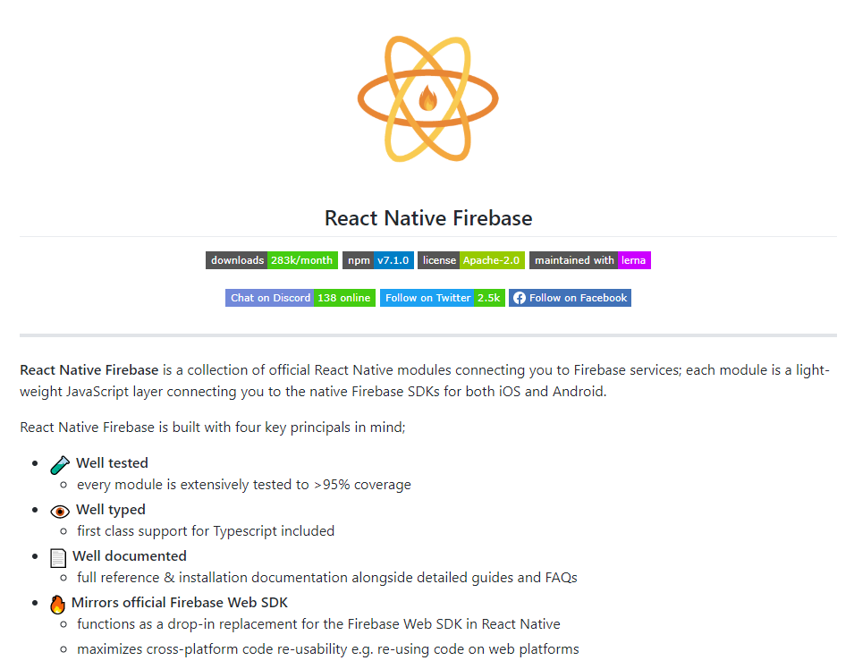 

## 15.  WordPress/gutenberg

项目地址：[https://github.com/WordPress/gutenberg](https://github.com/WordPress/gutenberg)

stars:5850 | forks:1927 | 7 stars today 

 WordPress和beyond的块编辑器项目。插件可以从官方存储库中获得。 

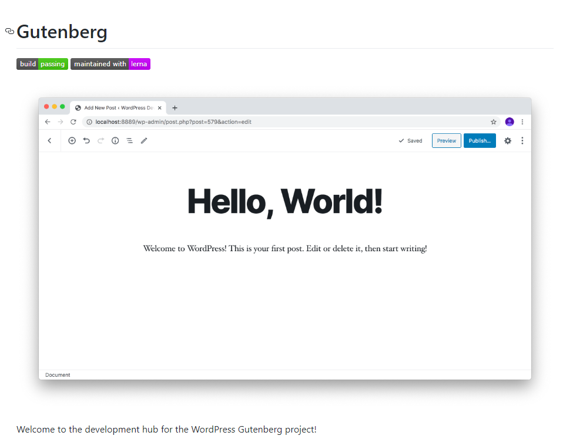

## 16.  NetEase/pomelo

项目地址：[https://github.com/NetEase/pomelo](https://github.com/NetEase/pomelo)

stars:10821 | forks:2804 | 5 stars today 

 一个用于Node.js的快速，可扩展的分布式游戏服务器框架。 

## 17.  angular/angular.js

项目地址：[https://github.com/angular/angular.js](https://github.com/angular/angular.js)

stars:59521 | forks:28713 | 6 stars today 

 AngularJS - HTML增强为web应用程序!  三大框架之一

## 18.  odoo/odoo

项目地址：[https://github.com/odoo/odoo](https://github.com/odoo/odoo)

stars:17520 | forks:12282 | 20 stars today 

 开源应用来发展你的业务。 

## 19.  strapi/strapi

项目地址：[https://github.com/strapi/strapi](https://github.com/strapi/strapi)

stars:25090 | forks:3035 | 102 stars today 

 开源Node.js Headless CMS可轻松构建可定制的API 

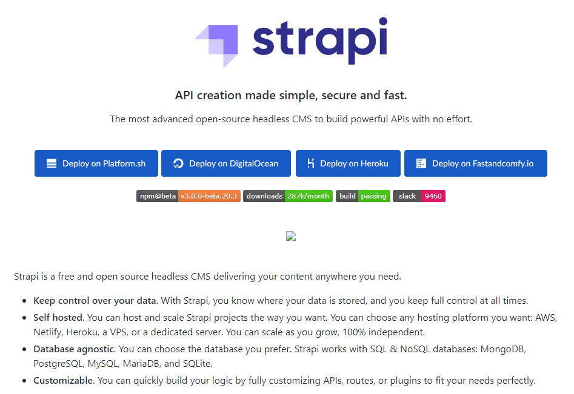

## 20.  da2k/curso-javascript-ninja

项目地址：[https://github.com/da2k/curso-javascript-ninja](https://github.com/da2k/curso-javascript-ninja)

stars:1695 | forks:2507 | 2 stars today 

Curso Javascript Ninja

## 21.  goldfire/howler.js

项目地址：[https://github.com/goldfire/howler.js](https://github.com/goldfire/howler.js)

stars:16267 | forks:1701 | 41 stars today 

 用于现代 web 的 Javascript 音频库。 

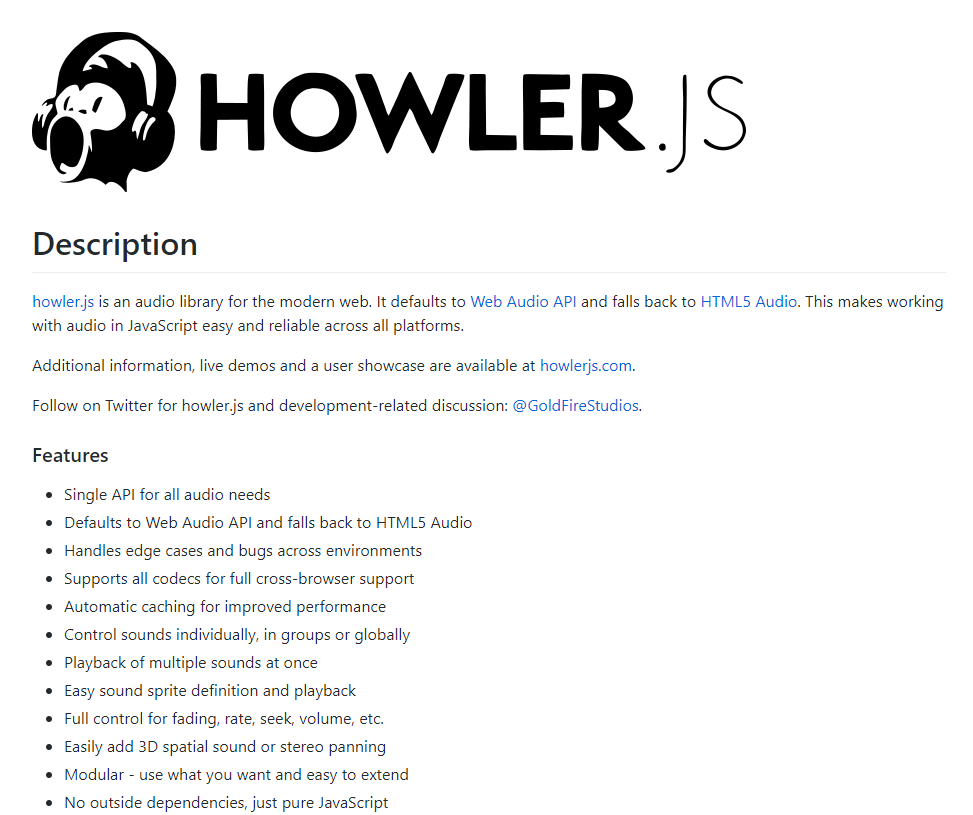

## 22.  developit/microbundle

项目地址：[https://github.com/developit/microbundle](https://github.com/developit/microbundle)

stars:4721 | forks:230 | 13 stars today 

 零配置打包器，用于微型模块。 

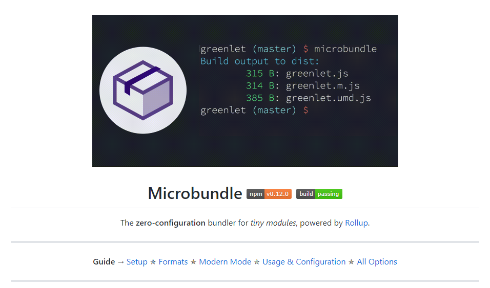

## 23.  heartexlabs/label-studio

项目地址：[https://github.com/heartexlabs/label-studio](https://github.com/heartexlabs/label-studio)

stars:2918 | forks:221 | 3 stars today 

 Label Studio是具有标准化输出格式的多类型数据标签和注释工具 

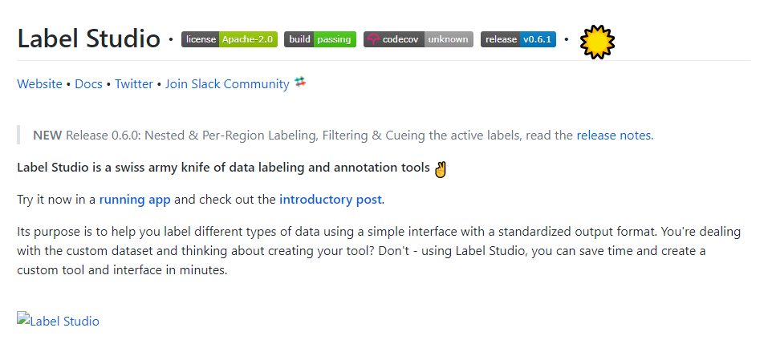

## 24.  eggjs/egg

项目地址：[https://github.com/eggjs/egg](https://github.com/eggjs/egg)

stars:15478 | forks:1548 | 19 stars today 

 为使用Node.js和Koa构建更好的企业框架和应用而生 （阿里出品）

## 25.  pcottle/learnGitBranching

项目地址：[https://github.com/pcottle/learnGitBranching](https://github.com/pcottle/learnGitBranching)

stars:17865 | forks:4239 | 85 stars today 

交互式的 git 可视化学习教程！

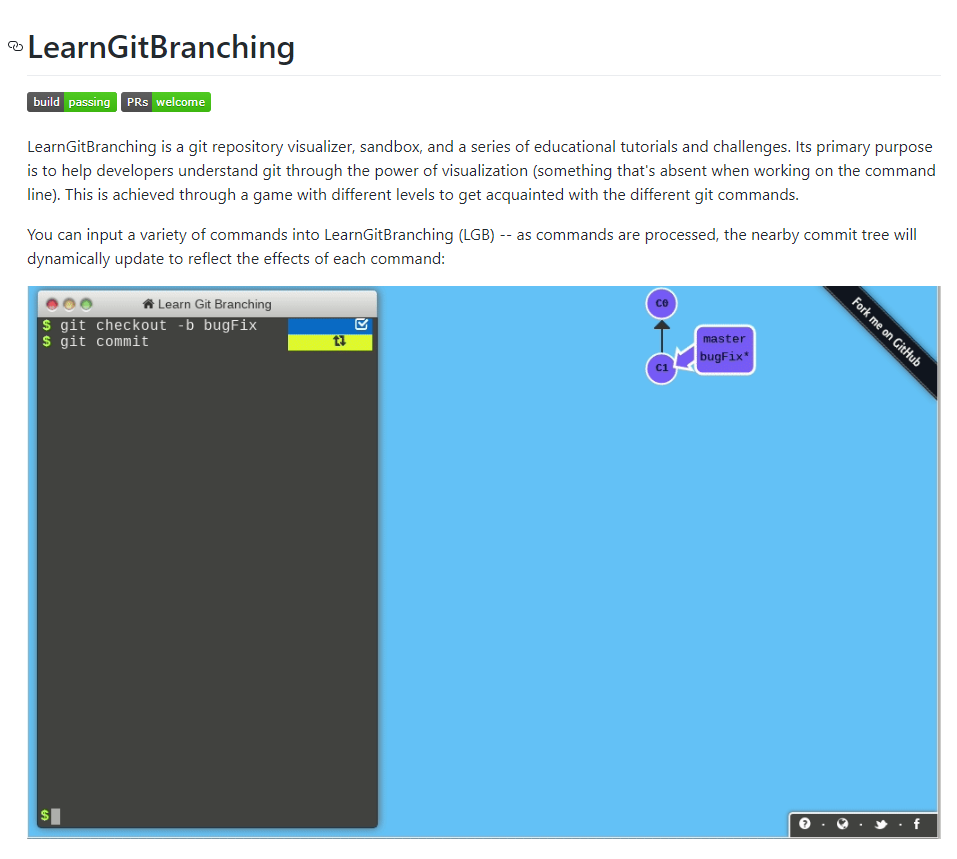