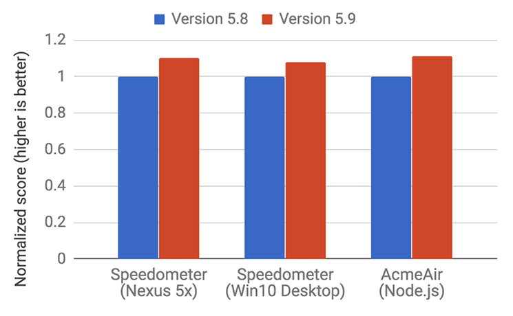
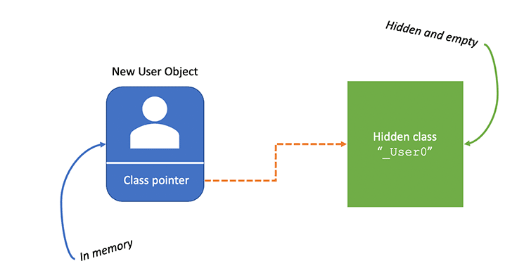
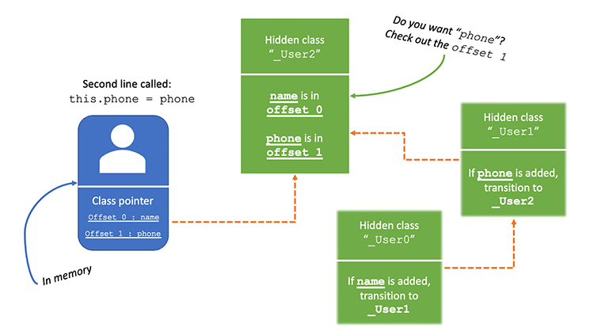

# 深入讨论 V8

> 原文作者：Diogo Souza
>
> 原文链接：https://blog.appsignal.com/2020/07/01/a-deep-dive-into-v8.html


大多数前端开发人员一直在讨论这个时髦词:V8。它的流行很大程度上是因为它将 JavaScript 的性能提升到了一个新的水平。

是的，V8非常快。 但是，它是如何发挥其魔力的，为什么它会如此敏捷？

官方文档指出，“ V8是用 `C ++` 编写的Google的开源高性能JavaScript和WebAssembly引擎。 它用于Chrome 和 Node.js 等。”

换句话说，V8是一个用c++开发的软件，可以将JavaScript转换成可执行机器代码。

Google Chrome和Node.js都只是将JavaScript代码传输到其最终目的地的桥梁：在该特定机器上运行的机器代码。

V8性能表现中的另一个重要角色是它的分代和超级精确的垃圾收集器。 它经过优化，收集JavaScript不再需要的对象，使得占用内存低。

除此之外，V8还依靠其他工具和功能来改善某些固有的 JavaScript 功能，这些功能在过去会使语言变慢(例如，它的动态特性)。

在本文中，我们将更详细地探讨这些工具（Ignition 和 TurboFan）及其功能。 除此之外，我们还将介绍V8的内部功能，编译和垃圾回收过程，单线程性质等基础知识。


## 1、从基础开始

机器代码如何工作？ 简而言之，机器代码是一堆非常低级的指令，它们在机器内存的特定部分中执行。

使用 c++ 语言作为参考生成它与它类似的功能：


在进一步讨论之前，必须指出这是一个编译过程，它与 JavaScript 解释过程不同。实际上，编译器在过程结束时生成整个程序，而解释器作为程序本身来工作，它通过读取指令(通常作为脚本，比如JavaScript脚本)并将它们翻译成可执行命令来完成这项工作。

解释过程可以是动态的(解释器解析并只运行当前命令)，也可以是完全解析的(即解释器在继续执行各自的机器指令之前首先完全翻译脚本)。

回到图中，正如所见，编译过程通常从源代码开始。实现代码，保存并运行。运行的进程依次从编译器开始。编译器是一个程序，像任何其他程序一样，运行在您的机器上。然后遍历所有代码并生成目标文件。那些文件就是机器代码。他们优化了运行在特定机器上的代码，这就是为什么当你从一个操作系统移动到另一个操作系统时，你必须使用特定的编译器。

但是您不能执行单独的目标文件，您需要将它们合并成一个单独的文件，即众所周知的.exe文件(可执行文件)。那是链接器(linker)的工作。

最后，加载器是负责将exe文件中的代码传输到操作系统虚拟内存的代理。它基本上是一个转运体。在这里，您的程序终于启动并运行了。

听起来像是一个漫长的过程，不是吗?

在大多数情况下（除非您是在银行大型机中使用Assembly的开发人员），您都将花费时间用高级语言进行编程：Java，C＃，Ruby，JavaScript等。

语言越高，速度越慢。这就是为什么 C 和 C++ 要快得多，它们非常接近机器代码语言:汇编语言。

除了性能之外，V8的一个主要好处是可以超越ECMAScript标准，也可以理解c++


JavaScript 受限于 ECMAScript。而V8为了生存，就必须兼容但不限于它。

在V8中具有非常棒的集成C++特性的能力。C++已经发展的非常好的OS操作：文件处理和内存/线程处理，在JavaScript中拥有所有这些能力是非常有用的。

如果您仔细想想，Node.js本身就是以类似的方式诞生的。 它采用了类似的方式来升级到V8，再加上服务器和网络功能。

## 2、单线程

如果您是Node开发人员，那么您应该很清楚V8的单线程性质。 每个JavaScript执行上下文都与一个线程成正比。

当然，V8在后台管理OS线程机制。 它是一个复杂的软件，并且可以同时执行许多工作，因此可以使用多个线程。

我们有一个执行代码的主线程，另一个用于编译代码的线程（是的，每次编译新代码时我们都无法停止执行），还有一些用于处理垃圾回收，等等。

然而，V8为每个JavaScript执行上下文创建了一个单线程环境。其余的都在它的控制之下。

想象一下您应该执行JavaScript代码的函数调用栈。 JavaScript通过按照插入/调用每个函数的顺序将一个函数堆叠在另一个函数之上来工作。 在介绍每个功能的内容之前，我们无法知道它是否调用了其他功能。 如果发生这种情况，那么被调用的函数将被放置在堆栈中调用者之后。

例如，当涉及到回调时，它们被放置在堆栈的末尾。

V8的主要任务之一是管理该堆栈组织和该过程所需的内存。

## 3、Ignition 和 TurboFan

自2017年5月发布5.9版以来，V8附带了一个新的JavaScript执行管道，该管道基于V8的解释器Ignition构建。 它还包括更新更好的优化编译器⁠-TurboFan。

这些变化完全集中在整体性能上，以及Google开发人员在调整引擎以适应JavaScript领域带来的所有快速而显著的变化时所面临的困难。

从项目一开始，V8的维护者就一直在担心能否找到一种好方法来提高V8的性能，使其与JavaScript的发展速度保持一致。

现在我们可以看到，在运行新引擎时，与最大的基准测试相比，有了巨大的改进



来源: https://v8.dev/blog/launching-ignition-and-turbofan*

你可以在这里和这里阅读更多关于 Ignition and TurboFan

- https://v8.dev/docs/ignition
- https://v8.dev/docs/turbofan

## 4、隐藏类

这是V8的另一个魔术。JavaScript是一种动态语言。这意味着可以在执行期间添加、替换和删除新属性。这在Java这样的语言中是不可能的，例如，所有的东西(类、方法、对象和变量)都必须在程序执行之前定义，并且不能在应用程序启动后动态更改。

由于其特殊的性质，JavaScript解释器通常根据散列函数执行字典查找，以确切知道该变量或对象在内存中的分配位置。

这在最终过程中花费很多。 在其他语言中，创建对象时，它们会收到一个地址（指针）作为其隐式属性之一。 这样，我们就确切知道它们在内存中的放置位置以及要分配的空间。

使用 JavaScript，这是不可能的，因为我们不能映射不存在的东西。这就是隐藏类统治的地方。

隐藏类几乎和 Java 中的一样:静态类和固定类都有一个唯一的地址来定位它们。然而，V8并不是在程序执行之前执行，而是在运行时执行，每当对象结构发生动态变化时。

让我们看一个例子来明白问题。 考虑以下代码片段：

```javascript
function User(name, fone, address) {
   this.name = name
   this.phone = phone
   this.address = address
}
```

在 JavaScript 基于原型的性质下，每次我们实例化一个新的 User 对象时，可以说：

```javascript
var user = new User("John May", "+1 (555) 555-1234", "123 3rd Ave")
```

然后，V8创建一个新的隐藏类。 我们称它为_User0。



每个对象在内存中都有一个对其类表示的引用。它是类指针。此时，因为我们刚刚实例化了一个新对象，所以在内存中只创建了一个隐藏类。它现在是空的。

当您执行此函数中的第一行代码时，将基于上一个隐藏类(这次是` _User1`)创建一个新的隐藏类。


基本上，它是具有`name` 属性的 `User` 的内存地址。 在我们的示例中，我们并没有使用仅具有名称的用户作为属性，但是每次您使用它时，都会加载隐藏的类V8作为参考。

`name` 属性被添加到内存缓冲区的偏移量0中，这意味着它将被视为最终顺序中的第一个属性。

V8 will also add a transition value to the `_User0` hidden class. This helps the interpreter to understand that every time a `name` property is added to a `User` object, the transition from `_User0` to `_User1` must be addressed.

V8还将向`_User0`隐藏类添加一个过渡值。 这有助于解释器理解，每次将`name`属性添加到`User`对象时，都必须吹里从`_User0`到`_User1`的转换。

当调用函数的第二行时，相同的过程再次发生，并创建一个新的隐藏类：



您可以看到，隐藏类跟踪堆栈。在由转换值维护的链中，一个隐藏类导致另一个隐藏类。

属性添加的顺序决定了V8将要创建多少隐藏类。如果您更改我们创建的代码片段中的行顺序，还将创建不同的隐藏类。这就是为什么一些开发人员试图维护重用隐藏类的顺序，从而减少开销。

## 5、高速缓存

这是 JIT（Just In Time）编译器世界中非常普遍的术语。 它与隐藏类的概念直接相关。

例如，每次调用将对象作为参数传递的函数时，V8都会查看此操作并思考：“嗯，该对象已成功两次或多次作为参数传递给该函数……为什么不将其存储在 我的缓存用于将来的调用，而不是再次执行整个耗时的隐藏类验证过程？”

让我们回顾一下最后一个例子：

```javascript
function User(name, fone, address) { // Hidden class _User0
   this.name = name // Hidden class _User1
   this.phone = phone // Hidden class _User2
   this.address = address // Hidden class _User3
}
```

在将实例化的任意值作为参数的用户对象两次发送给一个函数后，V8将跳过隐藏类查找并直接转到偏移量的属性。这要快得多。

但是，请记住，如果在函数中更改任何属性分配的顺序，则会产生不同的隐藏类，因此V8将无法使用高速缓存功能。

这是一个很好的例子，说明开发人员不应该不更深入地了解引擎。相反，拥有这些知识将帮助您的代码执行得更好。

## 6、垃圾回收

你还记得我们提到的V8在不同的线程中收集内存垃圾吗?所以，这很有帮助，因为我们的程序执行不会受到影响。

V8使用众所周知的“标记-清除策略”来收集内存中的死对象和旧对象。在这种策略中，GC扫描内存对象并将其标记为收集的阶段有点慢，因为它暂停执行以实现收集。

然而，V8是增量执行的。对于每个GC停止，V8尝试标记尽可能多的对象。它使一切都更快，因为在收集完成之前不需要停止整个执行。在大型应用程序中，性能改进会带来很大的不同。