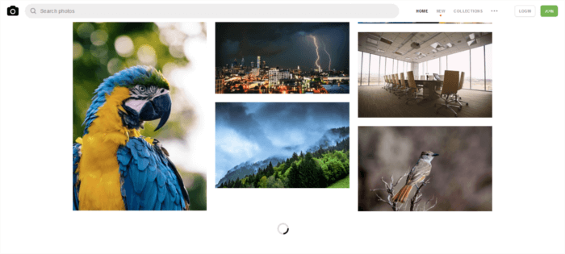

# 五种方法延迟加载图像，以获得更好的网站性能


> 原文地址：https://www.sitepoint.com/five-techniques-lazy-load-images-website-performance/
>
> 原文作者：[Maria Antonietta Perna](https://www.sitepoint.com/author/mperna)

由于图像是Web上最重要的内容之一，因此网站上的页面加载时间很容易成为问题。

即使进行了适当的优化，图像也可能会很重。 这会对访问者必须等待才能访问您网站上的内容的时间产生负面影响。 除非您想出一种不会影响速度感知的图像加载解决方案，否则离开你的网站。

在本文中，您将了解五种延迟加载图像的方法，可以将其添加到网络优化工具包中以改善网站上的用户体验。

## 1. 什么是延迟加载（懒加载）

延迟加载图片是指异步加载网站上的图片，也就是说，在首屏内容完全加载后，如果用户不向下滚动，放在页面底部的图片甚至不会被加载。

很多网站都使用这种方法，但在图片较多的网站上尤为明显。浏览您最喜欢的壁纸网站以获取高分辨率壁纸时，你很快就会意识到网站只能加载有限数量的图片。当您向下滚动页面时，您将看到占位符图像快速地被真实图像填充以进行预览。



## 2. 为什么要关心延迟加载图像？

这里有两个极其重要的因素，让您思考为网站延迟加载图像：

- 如果您的网站使用JavaScript来显示内容或向用户提供某种功能，则快速加载DOM变得至关重要。 脚本通常要等到DOM完全加载后才能开始运行。 在包含大量图像的网站上，延迟加载（或异步加载图像）可能会导致用户停留或离开您的网站有所不同。
- 由于大多数延迟加载解决方案仅在用户滚动到在视口内可见图像的位置时才加载图像，因此如果用户从未到达该点，则将永远不会加载这些图像。 这意味着可以节省大量带宽，为此，大多数用户，特别是那些在移动设备上访问Web且连接缓慢的用户，用户体验将非常的好。

好吧，延迟加载图片有助于提高网站性能，但是最好的解决方法是什么？

没有完美的办法。

如果您熟悉JavaScript，那么实现自己的延迟加载解决方案就不会成为问题。 没有什么比自己编写代码更能给你控制权了。

或者，您可以浏览Web以找到可行的方法并开始进行试验。 我就是这样做的，并遇到了这五种有趣的技术。

### 2.1 Native Lazy Loading

本地延迟加载图像和`iframes`是非常酷的。没有什么比下面的代码更直接的了

```html

<iframe src="content.html" loading="lazy"></iframe>
```

如您所见，没有`JavaScript`，也没有动态交换`src`属性的值，只是普通的`HTML`。

`loading`属性使我们可以选择延迟屏幕外图像和`iframe`，直到用户滚动到页面上的位置为止。 加载可以采用以下三个值之一：

- `lazy`：延迟加载
- `eager`：浏览器立即加载指定的内容
- `auto`：将选项保留为延迟加载或不延迟加载至浏览器。

这种方法无可匹敌：开销为零，简洁明了。 但是，尽管在撰写本文时，大多数主流浏览器都对`loading`属性提供了很好的支持，但并不是所有浏览器都支持。

### 2.2 IntersectionObserver API

Intersection Observer API是一个现代化的接口，您可以利用它来延迟加载图像和其他内容。

MDN引入此API的方法如下：

> Intersection Observer API提供了一种异步观察目标元素与祖先元素或顶级文档视口相交的变化的方法。

换句话说，被异步监视的是一个元素与另一个元素的交集。

Denys Mishunov在`IntersectionObserver`和使用它的延迟加载图像方面都有很好的教程。 这是他的解决方案。

假设您要延迟加载图片库。 每个图像的标记如下所示：

```html

```

请注意，图像的路径是如何包含在`data-src`属性而不是`src`属性中的。 原因是使用`src`意味着图像将立即加载，这不是您想要的。

在CSS中，为每个图像指定一个最小高度值，例如`100px`。 这为每个图像占位符（不带`src`属性的``元素）提供了一个垂直尺寸：

```css
img {
  min-height: 100px;
  /* more styles here */
}
```

然后，在`JavaScript`文档中，创建一个配置对象，并向一个`intersectionObserver`实例注册它：

```javascript
// create config object: rootMargin and threshold
// are two properties exposed by the interface
const config = {
  rootMargin: '0px 0px 50px 0px',
  threshold: 0
};

// register the config object with an instance
// of intersectionObserver
let observer = new intersectionObserver(function(entries, self) {
  // iterate over each entry
  entries.forEach(entry => {
    // process just the images that are intersecting.
    // isIntersecting is a property exposed by the interface
    if(entry.isIntersecting) {
      // custom function that copies the path to the img
      // from data-src to src
      preloadImage(entry.target);
      // the image is now in place, stop watching
      self.unobserve(entry.target);
    }
  });
}, config);
```

最后，遍历所有图像并将它们添加到这个`iterationObserver`实例中

```javascript
const imgs = document.querySelectorAll('[data-src]');
imgs.forEach(img => {
  observer.observe(img);
});
```

该解决方案的优点：实施起来轻而易举，有效，并且使 `intersectionObserver`在计算方面能够承担繁重的工作。

另一方面，虽然大多数浏览器都支持`IntersectionObserver` API的最新版本，但并非所有浏览器都始终支持该API。 幸运的是，可以使用`polyfill`。

### 2.3 Lozad.js

实现图像的延迟加载的一种快速简便的替代方法是让 `JS`库为您完成大部分工作。

Lozad.js 是纯`JavaScript`中的高性能，轻量且可配置的惰性加载器，没有任何依赖关系。 您可以使用它来延迟加载图像，视频，`iframe`和更多内容，并且它使用`IntersectionObserver API`。

您可以将Lozad.js包含在`npm / Yarn`中，并使用模块化将其导入：

```bash
npm install --save lozad

yarn add lozad
```

```javascript
import lozad from 'lozad';
```

另外，您可以简单地使用CDN下载该库并将其添加到`<script>`标记中的HTML页面底部：

```html
<script src="https://cdn.jsdelivr.net/npm/lozad/dist/lozad.min.js"></script>
```

接下来，对于基本实现，将`lozad`类添加到`html`标签上：

```html

```

最后，在您的JS文档中实例化Lozad：

```javascript
const observer = lozad();
observer.observe();
```

您将在Lozad GitHub存储库中找到有关如何使用该库的所有详细信息。

如果您不想深入了解`IntersectionObserver API`的工作原理，或者只是在寻找适用于各种内容类型的快速实现，则 Lozad.js 是一个不错的选择。

仅注意浏览器支持，并最终将此库与用于`Intersection Observer API`的polyfill集成。

### 2.4 延迟加载具有模糊的图像效果

如果您是仔细的读者，那么您肯定已经注意到该网站如何在帖子中加载主图像。

你首先看到的是一个模糊的、低分辨率的图像副本，而它的高分辨率版本正在被延迟加载


高分辨率，懒惰加载图像在媒体网站

您可以通过多种方式来延迟加载具有这种有趣的模糊效果的图像。

我最喜欢的技术是Craig Buckler。 这是此解决方案的全部优点：

- 性能：仅463B的CSS和1,007B的JavaScript代码
- 对视网膜屏幕的支持
- 无依赖性:不需要jQuery或其他库和框架
- 逐步增强功能以抵消较旧的浏览器和JavaScript失败

### 2.5 Yall.js

Yall是功能丰富的延迟加载脚本，用于图像，视频和`iframe`。 更具体地说，它使用Intersection Observer API并在必要时巧妙地使用传统的事件处理程序技术。

在文档中包含Yall时，需要按以下方式对其进行初始化：

```html
<script src="yall.min.js"></script>
<script>
  document.addEventListener("DOMContentLoaded", yall);
</script>
```

接下来，要延迟加载一个简单的`img`元素，您在标记中需要做的就是：

```html

```

注意：

- 将`class="lazy"`添加到元素
- `src`的值是一个占位符图像
- 您要延迟加载的图像的路径放到在`data-src`属性内

Yall的好处包括：

- Intersection Observer API的出色性能
- 出色的浏览器支持（可回溯到IE11）
- 不需要其他依赖项


## 3、结论

这样就可以了–延迟加载图像的五种方法，您可以开始在项目中进行试验和测试。

